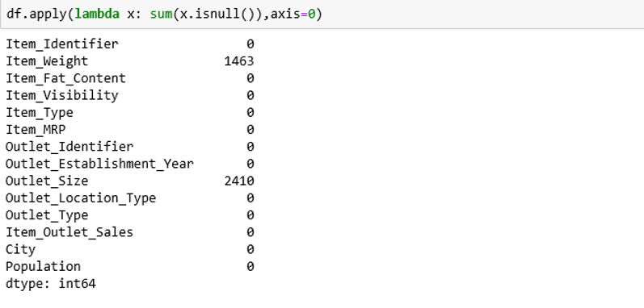
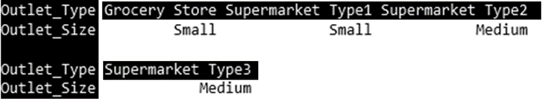

# Supermarket Data Analytics

### Problem Statement
- Analyze the patterns related to superstores' product sales.
- Use this data to explore functions in Tableau and Python for data analysis.

### About Data-Set
- The Big Mart dataset has over 8000 rows and 14 columns.
- It a collection of data about approximately 1550 products across 10 stores in different cities of Canada.

### Tools

### Requirements
- Python 3.5
- Jupyter Notebook
- pip Library
- Data analysis libraries (pandas, numpy and others)

### Analysis Steps

#### Step 1 (Create Dataframe)
Use Pandas library to store data set in a data frame
describe() function shows statistics about the dataset

#### Step 2 (Find null values)
isnull() – Get null values present in a column
sum(x.isnull()) – Number of cells with null values in a column
apply() – Apply a function ( eg. Apply function on data frame)

#### Step 3 (Missing Values)
Working on missing Outlet_Size
Take mode of Outlet_Size for each Outlet_Type and then impute results

#### Step 4 (Replace Values)
Different names used to represent single item.
For instance, Low Fat and LF in dataset have same meaning. So, replace ‘LF’ with ‘Low Fat’ and ‘reg’ with ‘Regular’’.

#### Step 5 (Export Data)
At last, export the data into .xlsx or .csv file.

## Data Visulaization With Tableau
- It is a data visualization tool.
- Every operations can be performed using drag and drop functionality. No coding required.
- It can connect with different data sources such as files, relational databases and others. .xls files used in this analysis.
- It can modify the data. For instance, new fields can be created using different operations.
- It can split, join, concatenate, change data type and perform other such tasks.
- Provides numerous types of graphs and can perform sum, average, median, mode and other such functions on data provided.
- Download Tableau: https://www.tableau.com/products/desktop/download
- The next step will be set up the Tableau and import the data set:

### Creating New Columns
New fields can be created from existing ones. Calculations like divide, multiply, addition, subtraction and others can be performed on numerical fields.

### Tableau Functionalities

##### Functions
Apply various functions on numeric value columns while plotting.

##### Annotation
Annotate the marks on trend lines.

##### Trends Found

